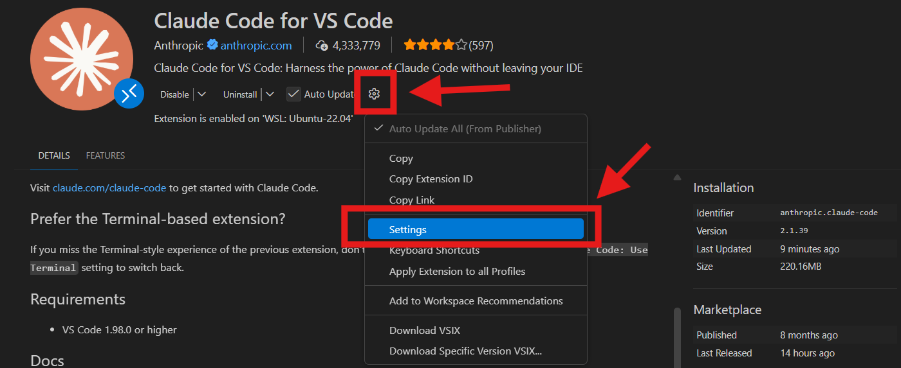
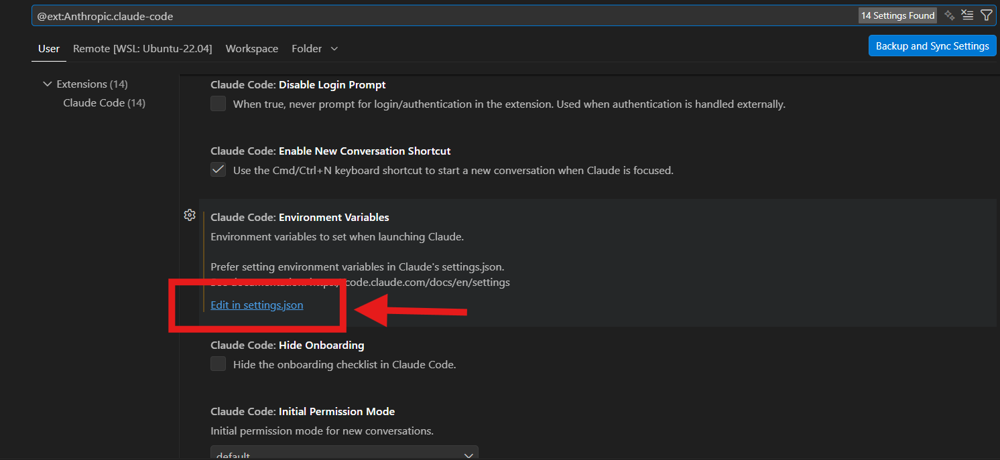

# Claude Code via Vertex AI — Setup Guide

StackArmor runs Claude Code backed by **Vertex AI** rather than the public Anthropic API. This means:

- No personal Anthropic API key or subscription required
- All API calls go through GCP and are fully auditable per-user
- Access is controlled via your existing GCP identity (gcloud ADC)
- The Vertex AI endpoint lives in the `armoryd2v-gss-prod` GCP project

---

## How Authentication Works

Claude Code uses [gcloud Application Default Credentials (ADC)](https://cloud.google.com/docs/authentication/application-default-credentials) to authenticate to Vertex AI.

StackArmor uses **cross-org access** so that employees in `thearmory.cloud`, `dev.thearmory.cloud`, and `gov.geckorobotics.com` can reach the Vertex AI endpoint in `armoryd2v-gss-prod` using their own identity — **no service account key, no shared credential**. Every API call is logged under your personal identity.

Assigned IAM groups in each org are limited to known StackArmor employees and granted the `Vertex AI User` role in `armoryd2v-gss-prod`.

> **Because of this, no custom gcloud profile configuration is necessary.** Just authenticate normally and Claude Code picks up your credentials automatically.

---

## Option A: VS Code Extension (Recommended)

### Step 1 — Install the Extension

Search for **"Claude Code"** in the VS Code Extensions panel (or Extensions for WSL: Ubuntu if on Windows) and install the extension published by `anthropic`.

Extension identifier: `anthropic.claude-code`



### Step 2 — Open Extension Settings

Click the **gear icon** on the Claude Code extension card, then select **Settings**.

### Step 3 — Configure Environment Variables

In the Settings panel, scroll to **Claude Code: Environment Variables** and click **"Edit in settings.json"**.



Add the following to VS Code's `settings.json`:

```json
"claudeCode.environmentVariables": [
  { "name": "CLAUDE_CODE_USE_VERTEX", "value": "1" },
  { "name": "CLOUD_ML_REGION",        "value": "global" },
  { "name": "ANTHROPIC_VERTEX_PROJECT_ID", "value": "armoryd2v-gss-prod" }
]
```

### Step 4 — Authenticate with gcloud

```bash
gcloud auth login --update-adc
```

This sets your Application Default Credentials so Claude Code (and VS Code) can reach Vertex AI under your identity.

### Step 5 — Start Using Claude Code

Click the Claude Code icon in the VS Code sidebar. You are ready.

---

## Option B: Terminal / CLI

### Step 1 — Install Claude Code

```bash
# WSL / Ubuntu / macOS
curl -fsSL https://claude.ai/install.sh | bash
```

### Step 2 — Authenticate with gcloud

```bash
gcloud auth login --update-adc
```

### Step 3 — Configure `~/.claude/settings.json`

Add the Vertex AI environment variables so they are set automatically every time you launch Claude Code:

```json
{
  "env": {
    "CLAUDE_CODE_USE_VERTEX": "1",
    "CLOUD_ML_REGION": "global",
    "ANTHROPIC_VERTEX_PROJECT_ID": "armoryd2v-gss-prod",
    "CLAUDE_CODE_DISABLE_AUTO_MEMORY": "0"
  }
}
```

> `CLAUDE_CODE_DISABLE_AUTO_MEMORY: "0"` **enables** auto memory, which helps Claude retain useful context across sessions. Set to `"1"` to disable it.

The example `settings-yolo.json` in this repo already includes these variables.

### Step 4 — (One-off) Per-session environment variables

If you prefer not to persist the config in `settings.json`, you can export per session:

```bash
export CLAUDE_CODE_USE_VERTEX=1
export CLOUD_ML_REGION=global
export ANTHROPIC_VERTEX_PROJECT_ID=armoryd2v-gss-prod
```

### Step 5 — Start Claude Code

```bash
claude
```

---

## Troubleshooting

| Symptom | Likely cause | Fix |
|---------|-------------|-----|
| `PERMISSION_DENIED` or `403` | Your GCP identity is not in an authorized group | Ask your manager to add your `@thearmory.cloud` account to the appropriate Vertex AI access group |
| `could not find default credentials` | ADC not set | Run `gcloud auth login --update-adc` |
| `PROJECT_NOT_FOUND` | Wrong project ID | Verify `ANTHROPIC_VERTEX_PROJECT_ID=armoryd2v-gss-prod` |
| Claude says it has no API key | Vertex env vars not set | Check `~/.claude/settings.json` or VS Code settings for the three env vars |
| Error after org/account switch | ADC pointing to wrong org | Re-run `gcloud auth login --update-adc` |

---

## Summary of Required Environment Variables

| Variable | Value |
|----------|-------|
| `CLAUDE_CODE_USE_VERTEX` | `1` |
| `CLOUD_ML_REGION` | `global` |
| `ANTHROPIC_VERTEX_PROJECT_ID` | `armoryd2v-gss-prod` |
